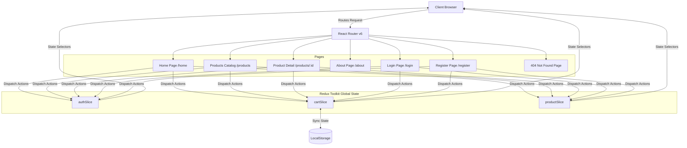

# 🛒 SkyMart — Next-Gen E-Commerce Web Application

[](https://fs-34-challenge-1.vercel.app/)
[](https://reactjs.org/)
[](https://redux-toolkit.js.org/)
[](https://reactrouter.com/)
[](https://tailwindcss.com/)
[](https://vitejs.dev/)
[](LICENSE)

---

## 📌 Executive Summary & Application Overview

**SkyMart** is a production-grade, state-of-the-art E-Commerce platform engineered with **React 18**, **Redux Toolkit**, **React Router v6**, and **Tailwind CSS**. Designed with modern glassmorphic aesthetic principles, fluid animations, and real-time state synchronization, SkyMart delivers a seamless digital shopping experience across desktop, tablet, and mobile interfaces.

The application features an end-to-end shopping workflow: complete authentication management (login, sign-up with auto-avatar generation, form validation, persistent sessions), full product catalog filtering & sorting across 50 curated items, interactive product detail pages with real-time stock and feature lists, a slide-over cart drawer with quantity controls and dynamic price calculations, an interactive About page featuring leadership profiles, and intelligent edge-case handling (custom 404 routes, empty filter states, and toast notifications).

> **Live Deployment:** [https://fs-34-challenge-1.vercel.app](https://fs-34-challenge-1.vercel.app/)

---

## 🚀 Key Features & Architectural Capabilities

### 🔐 1. Authentication & User Management Engine
- **Sign-In Flow (`/login`)**:
  - Secure credential verification with field validation.
  - Interactive password visibility toggle (Eye icon).
  - Persistence across browser refreshes using state rehydration.
  - User feedback alerts for invalid credentials (`"Invalid email or password"`) or missing inputs.
- **Registration Flow (`/register`)**:
  - Full Name, Email, Password, and Confirm Password fields.
  - Real-time password matching validation and duplicate email check (`"Email already registered!"`).
  - **Dynamic Avatar Generator**: Automatically derives user profile initials capitalized (e.g., `"Aryan Shah"` → `"A"`) upon sign-up.
  - Instant transition into active authenticated session upon successful account creation.
- **Auth Redux Slice (`authSlice`)**:
  - Tracks `user`, `isAuthenticated`, `error`, and `loading` states globally.

---

### 📦 2. Comprehensive Product Catalog & Discovery (`/products`)
- **Real-Time Live Search**:
  - Instant, non-blocking title and description search powered by debounced client-side filtering.
- **Category Filter Matrix**:
  - Supports 6 core categories: `Electronics`, `Clothing`, `Furniture`, `Home`, `Accessories`, and `Sports`.
  - Dynamic active category pill highlighting with item counter badges.
- **Multi-Factor Sorting**:
  - `price-asc`: Price: Low to High
  - `price-desc`: Price: High to Low
  - `rating-desc`: Highest Rated (Customer rating score)
  - `rating-asc`: Lowest Rated
- **Responsive Layout & Grid System**:
  - Responsive product card grid with hover zoom effects, category badges, star rating meters, item price displays, and instant "Add to Cart" triggers.
- **Empty State Recovery**:
  - Graceful fallback display when search query or filter returns zero results, paired with a one-click **"Clear Filters"** button.

---

### 🔍 3. Interactive Product Detail Page (`/products/:id`)
- **High-Resolution Gallery & Media**:
  - High-res product thumbnail showcasing Unsplash visual assets.
- **Product Metadata Breakdown**:
  - Category tags, average customer rating, review count, pricing, and stock status indicators.
  - Detailed product description and key feature specifications.
- **Cart & Buy Controls**:
  - Quantity selector (`-` / `+`) counter.
  - Dynamic button state: displays `"In cart: X"` when the item is already present in the active cart.
  - Instant **"Buy Now"** quick-checkout trigger.
- **Related Products Engine**:
  - Automatically fetches and displays related products from the same category at the bottom of the page.

---

### 🛍️ 4. Redux-Powered Shopping Cart & Slide-Over Drawer
- **Persistent LocalStorage State**:
  - Cart contents automatically persist across sessions via `localStorage` synchronization (`si(items)`).
- **Slide-Over Drawer UI**:
  - Accessible slide-over drawer accessible from any route via the global Header icon.
  - Dynamic item badge showing total cart item count (`totalQuantity`).
- **Interactive Controls**:
  - Item increment (`+`), decrement (`-`), and complete item removal trash actions.
  - Toast notification triggers on additions (`"Added to Cart"`) and removals (`"Removed from cart"`).
- **Financial Calculations**:
  - Live subtotal accumulation, dynamic delivery calculator (Free Delivery eligible on orders over ₹999+), coupon discount input box, and total order cost.
  - **"Clear Cart"** and **"Checkout"** order confirmation triggers.

---

### 🏢 5. Company About Page & Leadership (`/about`)
- **Brand Mission & Vision ("What We Stand For")**:
  - Overview of SkyMart's commitment to quality, affordability, customer satisfaction, and modern retail innovation.
- **Key Metrics & Statistics Counters**:
  - Highlights scale (e.g., 50+ Products, 6 Core Categories, 10,000+ Happy Customers, 99.9% On-time Delivery).
- **Leadership Team Showcase**:
  - **Aryan Shah** — Founder & CEO
  - **Priya Mehta** — Head of Product
  - **Rohan Verma** — Lead Engineer
  - **Sneha Kapoor** — Design Director
- **Core Values Grid**:
  - Quality Assurance, Customer First, Tech Innovation, and Sustainable Commerce.

---

### 🎨 6. Glassmorphic Design System & Aesthetics
- **Typography Stack**:
  - Headings & Display: `Cabinet Grotesk`, `Clash Display`, `Syne, sans-serif`
  - Body & UI Text: `DM Sans, sans-serif`
- **Color Palette**:
  - Primary Accent: Indigo / Violet (`#6366f1` / `#4f46e5`)
  - Dark Surfaces: Slate 900 (`#0f172a`), Slate 800 (`#1e293b`)
  - Backgrounds: Clean neutral tones (`#f8fafc`) with dark contrast modes
- **Micro-Animations & Motion**:
  - Smooth scale on hover, glass backdrop-filter blurring (`backdrop-blur-md`), transition durations (300ms cubic-bezier).

---

## 🏗️ System Architecture & Data Flow



---

## 🗺️ Application Routes & Page Mapping

| Path | Route Element | Description | Authentication Required |
| :--- | :--- | :--- | :---: |
| `/` | `<Home />` | Main Landing Page with Hero, Featured Items, Categories, and Value Props | ❌ |
| `/home` | `<Home />` | Primary Home view link target | ❌ |
| `/products` | `<Products />` | Full Catalog with Search, Category Filter, Price Range, and Sorting | ❌ |
| `/products/:id` | `<ProductDetail />` | Detailed view for individual item with specs and related products | ❌ |
| `/about` | `<About />` | Company vision, key metrics, values, and leadership team showcase | ❌ |
| `/login` | `<Login />` | User Sign-In card with credential validation and state persistence | ❌ |
| `/register` | `<Register />` | New account sign-up form with password validation & avatar initial creation | ❌ |
| `*` | `<NotFound />` | Custom 404 error view with return navigation triggers | ❌ |

---

## 💾 Redux State Schemas

### 1. Auth State (`authSlice`)
```typescript
interface AuthState {
  user: {
    id: string;
    name: string;
    email: string;
    avatar: string; // Dynamic initial letter, e.g. "A"
    joinedAt: string;
  } | null;
  isAuthenticated: boolean;
  error: string | null;
  loading: boolean;
}
```

### 2. Cart State (`cartSlice`)
```typescript
interface CartItem {
  id: number;
  title: string;
  price: number;
  image: string;
  category: string;
  quantity: number;
}

interface CartState {
  items: CartItem[];
  isOpen: boolean;
  totalQuantity: number;
  totalAmount: number;
}
```

### 3. Product Catalog State (`productSlice`)
```typescript
interface Product {
  id: number;
  title: string;
  price: number;
  description: string;
  category: "electronics" | "clothing" | "furniture" | "home" | "accessories" | "sports";
  image: string;
  rating: {
    rate: number;
    count: number;
  };
}

interface ProductState {
  items: Product[];
  selectedCategory: string;
  searchQuery: string;
  sortBy: "price-asc" | "price-desc" | "rating-desc" | "rating-asc" | "all";
  selectedProduct: Product | null;
}
```

---

## 📊 Sample Catalog Data Breakdown (50 Curated Items)

Below is a representative sample of items across SkyMart's 6 core product categories:

| ID | Title | Category | Price ($) | Rating | Review Count |
| :--- | :--- | :--- | :--- | :--- | :--- |
| **#1** | Wireless Bluetooth Headphones | `electronics` | $99.99 | ⭐ 4.5 | 120 reviews |
| **#2** | Smart Watch Series 5 | `electronics` | $299.99 | ⭐ 4.2 | 85 reviews |
| **#3** | Comfortable Cotton T-Shirt | `clothing` | $24.99 | ⭐ 4.0 | 200 reviews |
| **#4** | Ergonomic Office Chair | `furniture` | $199.99 | ⭐ 4.7 | 65 reviews |
| **#5** | Stainless Steel Water Bottle | `home` | $34.99 | ⭐ 4.3 | 150 reviews |
| **#6** | Professional Camera Lens | `electronics` | $499.99 | ⭐ 4.8 | 42 reviews |
| **#7** | Running Shoes | `clothing` | $89.99 | ⭐ 4.4 | 110 reviews |
| **#8** | Modern Coffee Table | `furniture` | $149.99 | ⭐ 4.1 | 50 reviews |
| **#9** | Aromatherapy Essential Oil Diffuser | `home` | $29.99 | ⭐ 4.6 | 95 reviews |
| **#10**| Wireless Gaming Mouse | `electronics` | $59.99 | ⭐ 4.5 | 180 reviews |
| **#11**| Yoga Mat | `sports` | $39.99 | ⭐ 4.3 | 210 reviews |
| **#12**| Leather Wallet | `accessories` | $45.00 | ⭐ 4.6 | 78 reviews |
| **#13**| 4K Ultra HD Monitor | `electronics` | $349.99 | ⭐ 4.7 | 92 reviews |
| **#14**| Mechanical Keyboard | `electronics` | $129.99 | ⭐ 4.8 | 165 reviews |
| **#15**| Portable Power Bank | `electronics` | $39.99 | ⭐ 4.5 | 310 reviews |

---

## 🛠️ Technology Stack Matrix

| Layer | Technology | Usage & Purpose |
| :--- | :--- | :--- |
| **Frontend Core** | React 18 | Declarative UI component tree & hooks |
| **State Management** | Redux Toolkit (`@reduxjs/toolkit`) | Global centralized store for Auth, Cart, and Products |
| **Routing** | React Router v6 (`react-router-dom`) | Client-side Single Page Application (SPA) routing |
| **Styling System** | Tailwind CSS | Utility-first styling, glassmorphic filters, responsive layout |
| **Typography** | Google Fonts (`Syne`, `DM Sans`, `Cabinet Grotesk`) | Premium luxury font pair for display & UI elements |
| **Iconography** | Lucide React | Lightweight SVG icons (`ShoppingCart`, `Search`, `User`, `Trash`, `Star`, etc.) |
| **Build Tooling** | Vite | Lightning-fast HMR and optimized production bundling |
| **Deployment Platform**| Vercel | Static asset hosting & edge deployment |

---

## 💻 Local Setup & Execution Guide

### Prerequisites
- **Node.js**: `v18.0.0` or higher
- **npm**: `v9.0.0` or higher (or `pnpm` / `yarn`)

### Installation Steps

1. **Clone the Repository:**
   ```bash
   git clone https://github.com/your-username/skymart.git
   cd skymart
   ```

2. **Install Dependencies:**
   ```bash
   npm install
   ```

3. **Start Development Server:**
   ```bash
   npm run dev
   ```
   The app will run locally at `http://localhost:5173`.

4. **Build for Production:**
   ```bash
   npm run build
   ```
   Produces optimized static build assets inside the `dist/` directory.

5. **Preview Production Build:**
   ```bash
   npm run preview
   ```

---

## ⚙️ Deployment & Vercel Configuration Notes

When deploying client-side single page applications (SPAs) using React Router on Vercel, static path requests like `/home` or `/login` may trigger a 404 status unless route rewrites are configured in `vercel.json`:

```json
{
  "rewrites": [
    {
      "source": "/(.*)",
      "destination": "/index.html"
    }
  ]
}
```

---

## 👥 Leadership Team

| Name | Position | Focus Area |
| :--- | :--- | :--- |
| **Aryan Shah** | Founder & CEO | Strategic Vision & Growth |
| **Priya Mehta** | Head of Product | Customer Experience & Roadmap |
| **Rohan Verma** | Lead Engineer | Architecture & Performance |
| **Sneha Kapoor** | Design Director | Aesthetics & Design System |

---

## 📜 License & Copyright

Designed & Developed for the **FS-34 Web Development Challenge**.  
Licensed under the [MIT License](LICENSE).  
Copyright © 2026 **SkyMart Inc.** All rights reserved.
